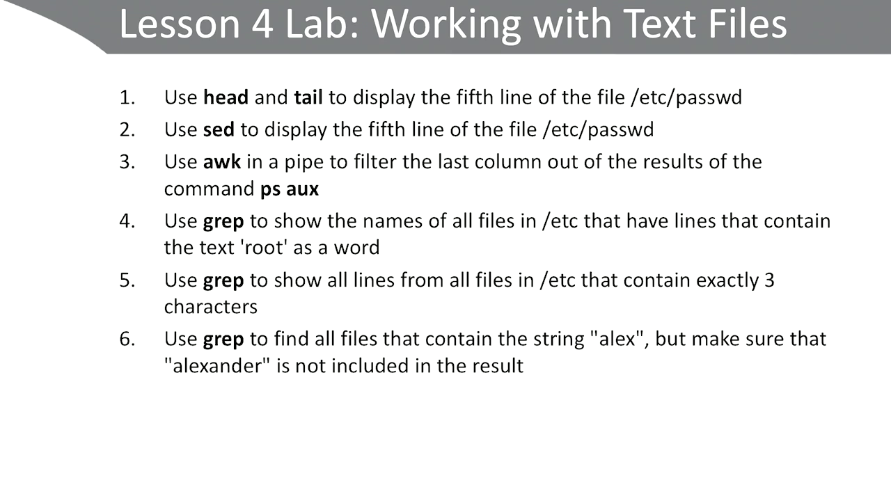
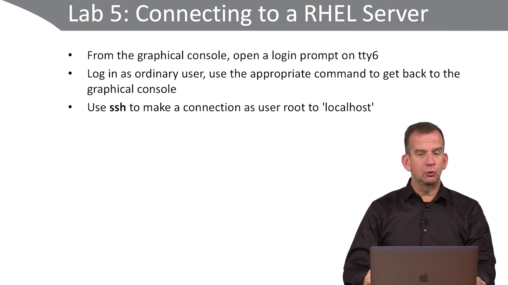
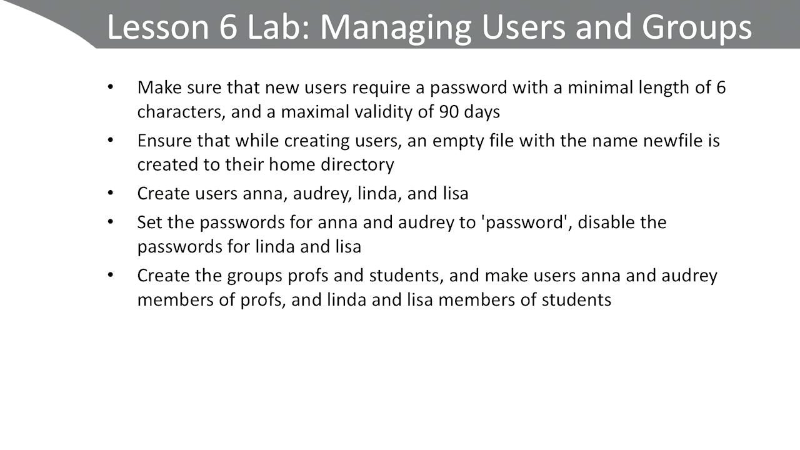
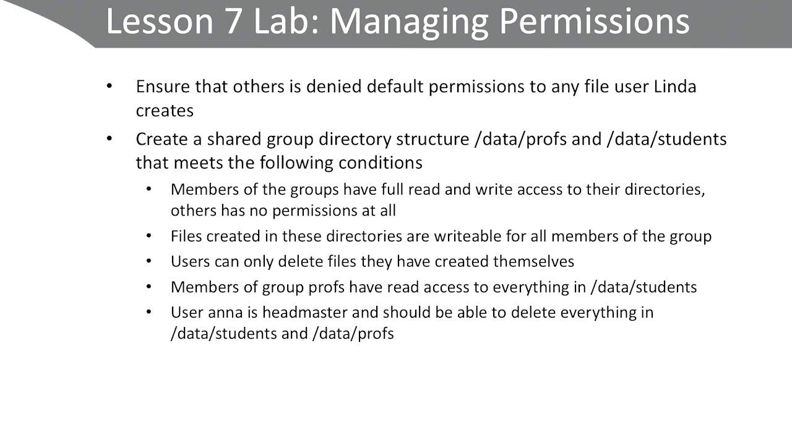
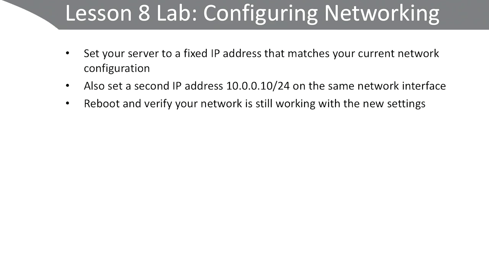
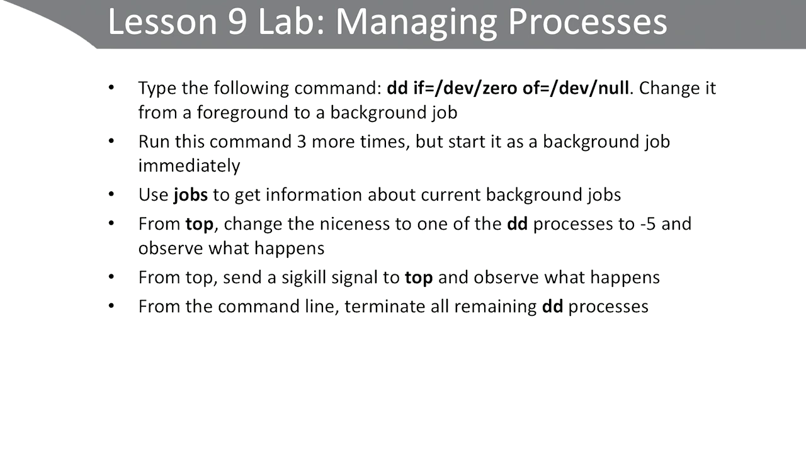

# RHCSA8
#### Solution for RHCSA8 course tasks 
## About the Course
Red Hat Certified System Administrator (RHCSA) 3rd Edition  
Author: Sander Van Vugt  
The Red Hat Certified System Administrator (RHCSA), 3rd edition is all new and fully updated for RHEL 8. This course is designed to teach you everything you need to know to pass the RHCSA exam. Every objective in the exam is discussed, along with in-depth lessons on complex topics, so they are not confusing. Each lesson ends with a lab, so you can dive into your own projects and see Red Hat in action; many of these labs mimic scenarios you might find on the exam, so you get the experience you need to practice for the exam. These labs also include video solutions, so you can also see in real-time how to work through the problems and figure out the best methods for working through each scenario.  
<!-- #### [Download 50GB](https://rutracker.org/forum/viewtopic.php?t=5760295)
#### [Download 2.6GB](https://1337x.to/torrent/4315827/RHCSA-8-Red-Hat-Certified-System-Administrator-3rd-Edition-by-Sander-van-Vugt/) -->
## Index
- [lesson 2](#lesson2): Using Essential Tools
- [lesson 3](#lesson3): Essential File Management Tools 
- [lesson 4](#lesson4): Working with Text Files
- [lesson 5](#lesson5): Connecting to a RHEL Server
- [lesson 6](#lesson6): Managing Users and Groups
- [lesson 7](#lesson7): Managing Permissions
- [lesson 8](#lesson8): Configuring Networking
- [lesson 9](#lesson9): Managing Processes
## <a name="lesson2"> Lesson 2

1.  - `mandb` update manual db
    - `man -k password` search for pages that contains word password
    - `man -k password | wc` count the results
    - unfortunatly we couldn't find any usefull results
2.  - `man useradd` and look for command in see also section
    - now we found `passwd` command
3.  - `useradd anna` add anna user first
    - `passwd anna` set a passwd for her
4.  - `cd /etc`
5.  - `ls -d *[0-9]*` note `-d` to list directories themselves, not their contents
6.  - `ls -l | less` then you can press `h` to browse commands 
7.  * some usefull commands in vim
    - `Esc` back to command mode
    - `i` insert mode
    - `a` append 
    - `o` open a new line
    - `:wq` write and quite
    - `:q!` quite and don't complain
    - `dd` delete a line
    - `yy` copy the current line
    - `p` paste
    - `G`  goto the last line in the file
    - `gg` goto the beggining of the file
    - `d$` delete after cursor in line
    - `$` move cursor to the end of the line
    - `^` move cursor to the start of the line
    - `v` visual mode to select text
    - `u` undo
    - `Ctrl + r` redo
    - `/text` search for text forword
    - `?text` search for text backword
    - `:%s/old/new` for replacing text
## <a name="lesson3"> Lesson 3

1.  - `mkdir -p /tmp/files/pictures`
    - `mkdir -p /tmp/files/photos`
    - `mkdir -p /tmp/files/videos`
2.  - `cp /etc/[a-c]* /tmp/files/`
3.  - `mv /tmp/files/[a-b]* /tmp/files/photos/`
    - `mv /tmp/files/c* /tmp/files/videos/`
4.  - `find /etc/ -size -1000c -exec cp {} /tmp/files/pictures`
5.  - `ln -s /var/ /tmp/files/varlink`
6.  - `tar -cvJf /tmp/files/home.tar.xz /home`
    - `-J` for .xz compression
7.  - `mkdir /tmp/arch/ ; tar -xvf /tmp/files/home.tar.xz -C /tmp/arch/`
    - note that we can use `Ctrl + a` to goto the start of the command line, and we can seperate commands using `;`
## <a name="lesson4"> Lesson 4

1.  - `head -n 5 /etc/passwd | tail -n 1`
2.  - `sed -n 5p /etc/passwd`
3.  - `ps aux | awk '{ print $NF }'`
4.  - `grep -R root /etc/ 2> /dev/null | cut -f 1 -d : | less`
5.  - `grep -R '^...$' /etc/ 2> /dev/null |less`
6.  - `grep -R 'alex$' /etc/ 2> /dev/null`
## <a name="lesson5"> Lesson 5

1.  - `chvt 6`
2.  - `chvt 1`
3.  - `ssh root@localhost`
## <a name="lesson6"> Lesson 6

1.  - edit file `/etc/login.defs` and set `PASS_MIN_LEN` to `6` and `PASS_MAX_DAYS` to `90`
    - note that you can change defaults in 
    - `/etc/login.defs` and `/etc/default/useradd`
2.  - `touch /etc/skel/newfile`
    - note that files in `/etc/skel/` dir will be created in user home upon creation
3.  - to add user `useradd username`
4.  - to change password `passwd username`
    - to lock password `passwd -l username`
5.  - to add group `groupadd name`
    - to add user to a group `usermod -aG gname uname`
## <a name="lesson7"> Lesson 7

1.  - `vim /home/linda/.bash_profile`
    - add this line `umask 007`
2.  - `mkdir /data/profs /data/students`
    - `chmod 3770 /data/students`
    - `chmod 3770 /data/profs`
    - `chown anna:profs /data/profs`
    - `chown anna:students /data/students`
    - `setfacl -m d:g:profs:rx /data/students`
## <a name="lesson8"> Lesson 8

-   you can do that using one of these option
    - `nmcli` and make sure that `bash-completion` is installed
    - `nmtui`
    - you can edit existing connection and reactivate it or add and activate a new one
    - or by editing config file `/etc/sysconfig/network-scripts/ifcfg-ens32`
## <a name="lesson9"> Lesson 9

1.  - `Ctrl+Z` to pause process
    - `bg` will move the most recent job to background
    - `bg [job id]` will move the job to the background
    - `fg`  will move the most recent job to foreground
2.  - `command &` will run the command in the background
3.  - `jobs` to list running jobs
4.  - some usefull commands in top
    - `h` for help
    - `r` for renice
    - `k` to kill processes
5.  - `9` sig kill
    - `15` sig terminate
6.  - `killall -15 dd`
    - install `psmisc` package if killall command not found